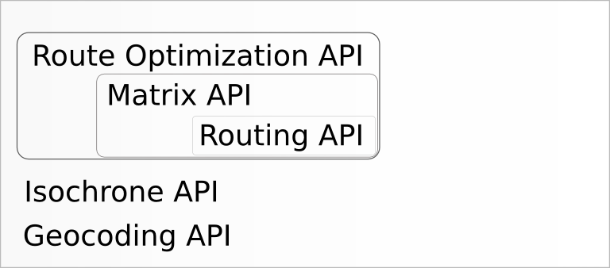

# GraphHopper Directions API for Business

With the [ GraphHopper Directions API for Business](https://graphhopper.com/#directions-api) you get a reliable and fast routing service with world wide coverage. We offer A-to-B routing via the Routing API optionally with turn instructions and elevation data as well as route optimization with various constraints like time window and capacity restrictions. Also it is possible to get all distances between all locations with our fast Matrix API.

The Directions API consists of the following parts:
[](./README.md)

## How to Start

 1. To use the Directions API you need an API key. Get it for free [here](https://graphhopper.com/#directions-api).
 2. Read the documentation for the **[Routing API](#routing-api)**, the **[Route Optimization API](#route-optimization-api)**, the **[Matrix API](#matrix-api)** and the **[Geocoding API](#geocoding-api)** below or try the examples in our dashboard.
 3. To increase your query limits for production you pay online within a few minutes via credit card or debit advice.

You can see the Routing and Geocoding API in action at [GraphHopper Maps](https://graphhopper.com/maps). You can see the Route Optimization API in action in the [route editor](https://graphhopper.com/blog/2015/07/21/graphhoppers-new-route-optimization-editor/) available in the [dashboard](https://graphhopper.com/#directions-api), the route optimization uses the Matrix API under the hood.

## Problems or Questions?

If you have problems or questions please see the [FAQ.md](FAQ.md) or [contact us](https://graphhopper.com/#contact).

Or search [our public forum](https://discuss.graphhopper.com/c/directions-api).

## API Clients and Examples

 * [JavaScript](https://github.com/graphhopper/directions-api-js-client) - try the [live examples](https://graphhopper.com/api/1/examples/)
 * [Java](https://github.com/graphhopper/directions-api-java-client)

Do not hesitate to share your client code with us!

## [Routing API](docs-routing.md)

[](./docs-routing.md)

The Routing API is documented [here](./docs-routing.md).

The endpoint is `https://graphhopper.com/api/[version]/route`

You get an example response via:

`curl "https://graphhopper.com/api/1/route?point=51.131108%2C12.414551&point=48.224673%2C3.867187&vehicle=car&locale=de&debug=true&points_encoded=false&key=[YOUR_KEY]"`

Where you need to replace the key with your own

## [Route Optimization API](./docs-route-optimization.md)

[](./docs-route-optimization.md)

The Route Optimization API is documented [here](./docs-route-optimization.md).

The endpoint is `https://graphhopper.com/api/[version]/vrp`

The Route Optimization API works in two steps

 1. Publish your problem json:
    `curl -X POST -H "Content-Type: application/json" "https://graphhopper.com/api/1/vrp/optimize?key=[YOUR_KEY]" --data @your-vrp-problem.json`
 2. Poll every 500ms until a solution is available:
    `curl -X GET "https://graphhopper.com/api/1/vrp/solution/[RETURNED_JOB_ID]?key=[YOUR_KEY]"`
  
For more details also about the format of the `your-vrp-problem.json` file you can use one of [the examples](https://github.com/graphhopper/directions-api-js-client/tree/master/route-optimization-examples).

## [Matrix API](./docs-matrix.md)

[](./docs-matrix.md)

The Matrix API is documented [here](./docs-matrix.md)

The endpoint is `https://graphhopper.com/api/[version]/matrix`

You get an example response for a 3x3 matrix looks via:

`curl "https://graphhopper.com/api/1/matrix?point=49.932707%2C11.588051&point=50.241935%2C10.747375&point=50.118817%2C11.983337&type=json&vehicle=car&debug=true&out_array=weights&out_array=times&out_array=distances&key=[YOUR_KEY]"`

## [Geocoding API](./docs-geocoding.md)

[](./docs-geocoding.md)

The Geocoding API is not yet production grade. Please help us improve it and give us feedback! See the documentation [here](./docs-geocoding.md).

The endpoint is `https://graphhopper.com/api/[version]/geocode`

You get an example response via:

`curl "https://graphhopper.com/api/1/geocode?q=berlin&locale=de&debug=true&key=[YOUR_KEY]"`

Append `&debug=true` for a formatted output.

<!--
## Isochrone API

Use this API to calculate reachability polygons for specific points. Please contact us for further details.


## Map Matching API

Use this API to match recorded GPS tracks with roads and associate useful information like turn instructions or speed limit, i.e. it provides a 'snap to road' functionality. Please contact us for further details.


-->

## [Terms of Services](https://graphhopper.com/terms.html)

Read the [terms of services](https://graphhopper.com/terms.html) carefully and make sure your user are agreeing to be bound by GraphHopper's Terms of Use too.

## Attribution

All packages require a prominent attribution of GraphHopper. This means you include a link to graphhopper.com in a place where you utilize the GraphHopper Directions API. It is important to note that the user has to see this only one time e.g. once per application start or at the first website access. The user must have the possibility and enough time to read and click on the link (at least 4 seconds). I.e. a short living splash screen isn't what we want, instead we ask you to place it e.g. below a search input. As a simple example have a look at [GraphHopper Maps](https://graphhopper.com/maps/)

An HTML snippet for this is:

```html
Powered by <a href="https://graphhopper.com/#directions-api">GraphHopper API</a>
```

If you use the on-premises option please use the following snippet:
```html
Uses <a href="https://graphhopper.com/">GraphHopper</a>
```

For small screens (less than 190mm diagonal) it can be only the link without 'powered by' or 'uses'. If you need a custom or white-label solution please contact us.

Additionally to our attribution you need to include attribution to [OpenStreetMap](https://www.openstreetmap.org/copyright/).

## HTTP Error codes

HTTP error code | Reason
:---------------|:------------
400             | Something was wrong in your request. Too few or too many points. ..
401             | Authentication necessary
413             | Too many parameters in the URL, you'll have to use the JSON format and POST requests
429             | API limit reached, you'll also get an email about this, and the header properties will give you more information: X-RateLimit-Limit (your current daily limit), X-RateLimit-Remaining (your remaining credits) and X-RateLimit-Reset (the number of seconds that you have to wait).
500             | Internal server error. We get automatically a notification and will try to fix this fast.
501 	           | Only a special list of vehicles is supported


### Output
```json
{
  "message": "Cannot find point 2: 2248.224673, 3.867187",
  "hints": [{"message": "something", ...}]
}
```

Sometimes a point can be "off the road" and you'll get 'cannot find point', this normally does not
indicate a bug in the routing engine and is expected to a certain degree if too far away.

JSON path/attribute    | Description
:----------------------|:------------
message                | Not intended to be displayed to the user as it is currently not translated
hints                  | An optional list of details regarding the error message e.g. `[{"message": "first error message in hints"}]`
