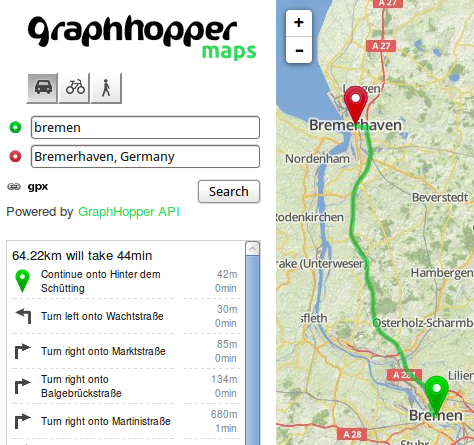
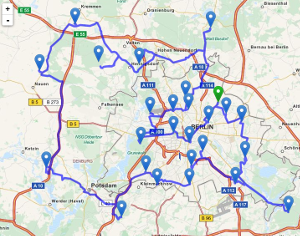
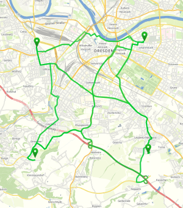
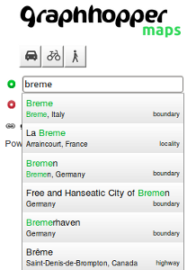

# GraphHopper Directions API for Business

With the [ GraphHopper Directions API for Business](https://graphhopper.com/#directions-api) you get a reliable and fast routing service with world wide coverage. We offer a Routing API for A-to-B routing optionally with turn instructions and elevation data. Also it is possible to get all distances between all locations with our fast Matrix API.


## How to Start

 1. To use the Directions API you need an API key. Get it for free [here](https://graphhopper.com/#directions-api).
 2. Read the documentation for the **Routing API**, the **Matrix API** and the **Geocoding API** below or try the examples in our dashboard.
 3. To increase your query limits for production you pay online within a few minutes via credit card or debit advice.

You can see the Routing and Geocoding API in action at [GraphHopper Maps](https://graphhopper.com/maps).

## Problems or Questions?

If you have problems or questions please see the [FAQ.md](FAQ.md) or [contact us](https://graphhopper.com/#contact).

## API Clients and Examples
                        
 * [JavaScript](https://github.com/graphhopper/directions-api-js-client)
 * [Java](https://github.com/graphhopper/directions-api-java-client)

Do not hesitate to share your client code with us!

## [Routing API](docs-routing.md)



The Routing API is documented [here](docs-routing.md).

The endpoint is `https://graphhopper.com/api/[version]/route`

You get an example response via:

`curl "https://graphhopper.com/api/1/route?point=51.131108%2C12.414551&point=48.224673%2C3.867187&vehicle=car&locale=de&debug=true&points_encoded=false&key=[YOUR_KEY]"`

Where you need to replace the key with your own

## Tour Optimization API



Use this API for traveling salesman or vehicle routing problems. 
For example for a pizza delivery service to directly optimize the order of the 
requested delivery points, include maximum vehicles and more. 
Please contact us if you want to take part as an alpha tester.

## [Matrix API](./docs-matrix.md)



The Matrix API is documented [here](./docs-matrix.md)

The endpoint is `https://graphhopper.com/api/[version]/matrix`

You get an example response for a 3x3 matrix looks via:

`curl "https://graphhopper.com/api/1/matrix?point=49.932707%2C11.588051&point=50.241935%2C10.747375&point=50.118817%2C11.983337&type=json&vehicle=car&debug=true&out_array=weights&out_array=times&out_array=distances&key=[YOUR_KEY]"`

## [Geocoding API](./docs-geocoding.md)



The Geocoding API is not yet production grade. Please help us improve it and give us feedback! See the documentation [here](./docs-geocoding.md).

The endpoint is `https://graphhopper.com/api/[version]/geocode`

You get an example response via:

`curl "https://graphhopper.com/api/1/geocode?q=berlin&locale=de&debug=true&key=[YOUR_KEY]"`

Append `&debug=true` for a formatted output.

## Isochrone API

Use this API to calculate reachability polygons for specific points. Please contact us if you want to take part as an alpha tester.


## Map Matching API

Use this API to match recorded GPS tracks with roads and associate useful information like turn instructions or speed limit, i.e. it provides a 'snap to road' functionality. Please contact us if you want to take part as an alpha tester.


## [Issues](https://github.com/graphhopper/web-api/issues)

If you have problems please report them [here](https://github.com/graphhopper/web-api/issues).


## [Terms of Services](https://graphhopper.com/terms.html)

Read the [terms of services](https://graphhopper.com/terms.html) carefully and make sure your user are agreeing to be bound by GraphHopper's Terms of Use too.

## Attribution

All packages requires a prominent attribution of GraphHopper. This means you include a link to graphhopper.com where you utilize the GraphHopper Directions API. It is important to note that the user has to see this only one time e.g. once per application start or at the first website access. The user must have the possibility and enough time to read and click on the link e.g. including it only in a short living spash screen isn't appropriate where as including this in or below a search input is appropriate. For an example you can look at [GraphHopper Maps](https://graphhopper.com/maps/)

An HTML snippet for this is:

```html
powered by <a href="https://graphhopper.com/#directions-api">GraphHopper API</a>
```

For small screens (less than 190mm diagonal) it can be only the link:

```html
<a href="https://graphhopper.com/#directions-api">GraphHopper</a>
```

If you need a custom or white-label solution please contact us.

Additionally to our attribution you need to include attribution to [OpenStreetMap](https://www.openstreetmap.org/copyright/).

## HTTP Error codes

HTTP error code | Reason
:---------------|:------------
400             | Something was wrong in your request. Too few or too many points. ..
401             | Authentication necessary
413             | Too many parameters in the URL, you'll have to use the JSON format and POST requests
429             | API limit reached, you'll also get an email about this, and the header properties will give you more information: X-RateLimit-Limit (your current daily limit), X-RateLimit-Remaining (your remaining credits) and X-RateLimit-Reset (number of seconds until you have to wait).
500             | Internal server error. We get automatically a notification and will try to fix this fast.
501 	           | Only a special list of vehicles is supported


### Output
```json
{
  "message": "Cannot find point 2: 2248.224673, 3.867187",
  "hints": [{"message": "something", ...}]
}
```

Sometimes a point can be "off the road" and you'll get 'cannot find point', this normally does not
indicate a bug in the routing engine and is expected to a certain degree if too far away.

JSON path/attribute    | Description
:----------------------|:------------
message                | Not intended to be displayed to the user as it is currently not translated
hints                  | An optional list of details regarding the error message e.g. `[{"message": "first error message in hints"}]`
