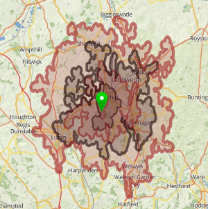
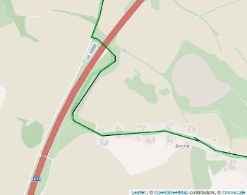

# GraphHopper Directions API

With the [ GraphHopper Directions API](https://graphhopper.com/#directions-api) you get reliable and fast web services for routing and more
with world wide coverage. We offer A-to-B routing via the Routing API optionally with turn instructions and elevation data as well as 
route optimization with various constraints like time window and capacity restrictions. Also it is possible to get all distances 
between all locations with our fast Matrix API.

The GraphHopper Directions API consists of the following parts:

 * the [Routing API](./routing.md), 
 * the [Route Optimization API](./route-optimization.md),
 * the [Isochrone API](./isochrone.md),
 * the [Map Matching API](./map-matching.md),
 * the [Matrix API](./matrix.md) and 
 * the [Geocoding API](./geocoding.md).

## How to Start

 1. To use the Directions API you need an API key. Get it for free [here](https://graphhopper.com/#directions-api).
 2. Read the documentation below or try the examples in our dashboard.
 3. To increase your query limits for production you pay online within a few minutes via credit card or debit advice.

You can see the Routing and Geocoding API in action at [GraphHopper Maps](https://graphhopper.com/maps). You can see the Route Optimization API in action in the [route editor](https://graphhopper.com/blog/2015/07/21/graphhoppers-new-route-optimization-editor/) available in the [dashboard](https://graphhopper.com/#directions-api), the route optimization uses the Matrix API under the hood.

## Problems or Questions?

If you have problems or questions please see the [FAQ.md](FAQ.md) or [contact us](https://graphhopper.com/#contact).

Or search [our public forum](https://discuss.graphhopper.com/c/directions-api).

## Pricing

The pricing is available [here](https://graphhopper.com/#pricing) or with all details about monthly/annually [in the dashboard](https://graphhopper.com/dashboard/).

## API Clients and Examples

 * [JavaScript client](https://github.com/graphhopper/directions-api-js-client) - try the [live examples](https://graphhopper.com/api/1/examples/)
 * [Java client](https://github.com/graphhopper/directions-api-java-client)
 * [Others](https://github.com/graphhopper/directions-api-clients-route-optimization) like C#, Ruby, PHP, Python, ... automatically created for the Route Optimization API with our [swagger spec](https://graphhopper.com/api/1/vrp/swagger.json).

Let us know your language requirements!
  
### Clients from our Customers and Community

 * [C# client](https://github.com/Schuby80/WpfGraphHopper), MIT license

**Examples and Applications**:

 * [Use cases](https://graphhopper.com/#usecases)

Do not hesitate to share your websites, apps or API clients with us!

## Keep up-to-date

To get informed about the newest features and development follow us at [twitter](https://twitter.com/graphhopper/) or our [blog](https://graphhopper.com/blog/). Furthermore you can watch [this git repository](https://github.com/graphhopper/directions-api) of this documentation, sign up at our [dashboard](https://graphhopper.com/dashboard/) to get the newsletter or sign up at [our forum](https://discuss.graphhopper.com/c/directions-api). Pick the channel you like most.

# [Routing API](./routing.md)

[](./routing.md)

The Routing API is documented [here](./routing.md).

# [Route Optimization API](./route-optimization.md)

[](./route-optimization.md)

The Route Optimization API is documented [here](./route-optimization.md).

# [Isochrone API](./isochrone.md)

[](./isochrone.md)

The Isochrone API is documented [here](./isochrone.md)

# [Map Matching API](./map-matching.md)

[](./map-matching.md)

The Map Matching API is documented [here](./map-matching.md)

# [Matrix API](./matrix.md)

[](./matrix.md)

The Matrix API is documented [here](./matrix.md)

# [Geocoding API](./geocoding.md)

[](./geocoding.md)

The Geocoding API is documentation [here](./geocoding.md).

<!--

# Map Matching API

Use this API to match recorded GPS tracks with roads and associate useful information like turn instructions or speed limit, i.e. it provides a 'snap to road' functionality. Please contact us for further details.


-->

# [Terms of Services](https://graphhopper.com/terms.html)

Read the [terms of services](https://graphhopper.com/terms.html) carefully and make sure your user are agreeing to be bound by GraphHopper's Terms of Use too.

# Attribution

All packages require a prominent attribution of GraphHopper and a public accessible application e.g. web application or app in one of the app stores.
This means you include a link to graphhopper.com in a place where you utilize the GraphHopper Directions API. 
It is important to note that the user has to see this only one time e.g. once per application start 
or at the first website access. The user must have the possibility and enough time to read and 
click on the link at least 4 seconds. I.e. a short living splash screen isn't what we want, 
instead we ask you to place it e.g. below a search input. As a simple example have a look 
at [GraphHopper Maps](https://graphhopper.com/maps/)

An HTML snippet for this is:

```html
Powered by <a href="https://graphhopper.com/#directions-api">GraphHopper API</a>
```

If you use the on-premises option please use the following snippet:
```html
Uses <a href="https://graphhopper.com/">GraphHopper</a>
```

For small screens (less than 190mm diagonal) it can be only the link without 'powered by' or 'uses'. 
If you want to use the GraphHopper Directions API for an in-house or via a white-label solution please contact us.

Additionally to our attribution you always need to include 
attribution to [OpenStreetMap](https://www.openstreetmap.org/copyright/), regardless of e.g. white-label options.

# HTTP Headers

HTTP header key | 	Description
:---------------|:-------------
X-RateLimit 	   | Your current daily credit limit
X-RateLimit-Remaining | 	Your remaining credits until the reset
X-RateLimit-Reset 	   | The number of seconds that you have to wait before a reset of the credit count is done
X-RateLimit-Credits 	 | The credit costs for this request. Note, it could be a decimal and even negative number, e.g. when an async request failed.

# HTTP Error codes

HTTP error code | Reason
:---------------|:------------
400             | Something was wrong in your request. Too few or too many points. ..
401             | Authentication necessary
413             | Too many parameters in the URL, you'll have to use the JSON format and POST requests
429             | API limit reached, you'll also get an email about this, and the header properties will give you more information. See the section about 'HTTP Headers'.
500             | Internal server error. We get automatically a notification and will try to fix this fast.
501 	           | Only a special list of vehicles is supported


## Error Output
```json
{
  "message": "Cannot find point 2: 2248.224673, 3.867187",
  "hints": [{"message": "something", ...}]
}
```

Sometimes a point can be "off the road" and you'll get 'cannot find point', this normally does not
indicate a bug in the routing engine and is expected to a certain degree if too far away.

JSON path/attribute    | Description
:----------------------|:------------
message                | Not intended to be displayed to the user as it is currently not translated
hints                  | An optional list of details regarding the error message e.g. `[{"message": "first error message in hints"}]`
