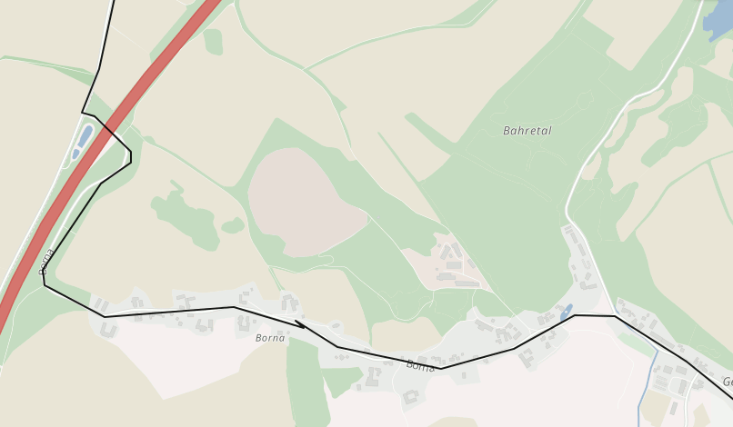

## Map Matching API

### Endpoint

The endpoint is `https://graphhopper.com/api/[version]/match`

You get an example response for a GPX via:

`curl -XPOST -H "Content-Type: application/gpx+xml" "https://graphhopper.com/api/1/match?vehicle=car&key=[YOUR_KEY]" --data @/path/to/some.gpx`

### Introduction

The Map Matching API is part of the [GraphHopper Directions API](https://graphhopper.com/#directions-api) and 
with this API you can snap measured GPS points typically as GPX files to a digital road network to e.g. clean 
data or attach certain data like elevation or turn instructions to it. Read more at [Wikipedia](https://en.wikipedia.org/wiki/Map_matching).

In the example screenshot above and demo you see the Map Matching API in action where the black line is the GPS track and
the green one is matched result.

### API Clients and Examples

See the [clients](./index.md#api-clients-and-examples) section in the main document and [live examples](https://graphhopper.com/api/1/examples/#map-matching).

### Description

The Map Matching API snaps real word measurements in form of GPX tracks 
to the digital road network to clean up this data or attach data to it.

### Input format

The supported input format is [GPX 1.1](http://www.topografix.com/GPX/1/1/) (application/gpx+xml). A json format is under work.

### Parameters

All parameters are shown in the following table:

Parameter   | Default | Description
:-----------|:--------|:-----------
gps_accuracy| 50      | The precision of the GPS locations in meters, from minimum of 5 to maximum 100.
vehicle     | car     | The vehicle for which the route should be snapped. See [here](./supported-vehicle-profiles.md) for all options.
locale      | en      | The locale of the resulting instructions
type        | json    | The output format, can be gpx or json.
debug       | false   | If true, the output will be formated.

Further parameters from the [Routing API](routing.md#parameters) do apply here too.

### Limits and Counts

The cost for one request depends on the number of GPS location and is documented [here](FAQ.md).

One request should not exceed the Map Matching API location limit depending on the package, 
see the pricing in our dashboard.

### JSON Output

The output is currently the one of the [Routing API](routing.md#output), plus the `map_matching` entry.
See here the most important entries:

JSON path/attribute        | Description
:--------------------------|:------------
paths                      | An array of possible paths
paths[0].distance          | The total distance of the route, in meter
paths[0].time              | The total time of the route, in ms
paths[0].points            | This value contains the coordinates of the path. If `points_encoded=true` or no `points_encoded` specified an encoded string will be returned, otherwise an array with order [lon,lat,elevation] is returned. See the parameter `points_encoded` for more information.
paths[0].instructions      | Contains information about the instructions for this route. The last instruction is always the Finish instruction and takes 0ms and 0meter. Keep in mind that instructions are currently under active development and can sometimes contain misleading information, so, make sure you always show an image of the map at the same time when navigating your users!
map_matching.distance      | The distance in meter of the matched path
map_matching.time          | The time in ms of the matched path
map_matching.original_distance | The distance in meter of the original track
map_matching.original_time     | The time in ms of the original track

## HTTP Error codes

See more details in the [overview](index.md#http-error-codes)

