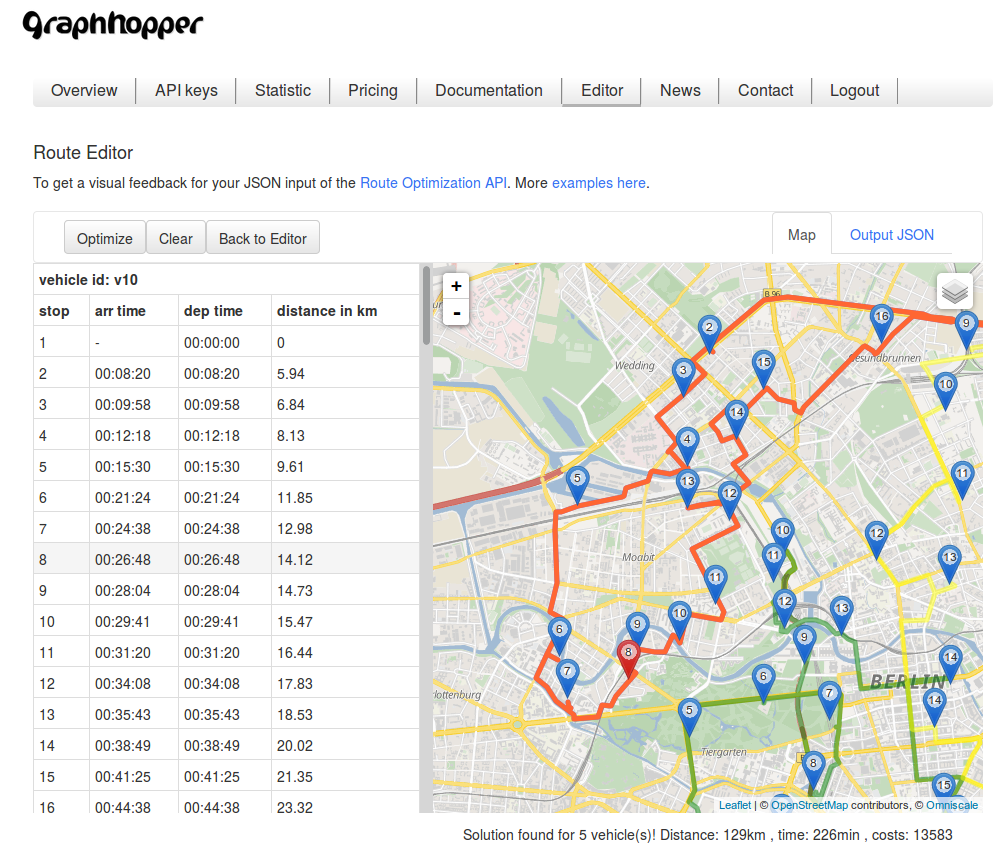

## Route Optimization API

### Endpoint

The endpoint is `https://graphhopper.com/api/[version]/vrp`

The Route Optimization API works in two steps

 1. Post your problem json:
    `curl -X POST -H "Content-Type: application/json" "https://graphhopper.com/api/1/vrp/optimize?key=[YOUR_KEY]" --data @your-vrp-problem.json`
 2. Poll every 500ms until a solution is available:
    `curl -X GET "https://graphhopper.com/api/1/vrp/solution/[RETURNED_JOB_ID]?key=[YOUR_KEY]"`
  
For more details also about the format of the `your-vrp-problem.json` file you can use one of [the examples](https://github.com/graphhopper/directions-api-js-client/tree/master/route-optimization-examples).

### Introduction



The Route Optimization API can be used to solve traveling salesman or vehicle routing problems. These problems occur almost everywhere in the world 
of moving things and people. For example, every company dealing with last-mile deliveries faces a vehicle routing problem, i.e. it must find ways to
efficiently service its customers given a variety of requirements: customer requirements (e.g. time windows), 
the product's transport requirements (e.g. refrigerated, must be picked up first), driver skills, vehicles/capacities available etc..

Even these problems are relatively easy to understand, finding reasonable solutions is way more difficult. 
You need to calculate travel times and distances on large (road) networks, you need to formalize your vehicle routing problem and to specify
 your manifold business constraints, you need fast and efficient algorithms and quite a significant amount of computational power.
  
 This is where <b>GraphHopper Route Optimization</b> comes into play. Just learn how to put your problem into our easy-to-understand json format, post it and <b>GraphHopper</b> will do the heavy work.
 To make it even easier for you, we provide you with the following clients.


### Clients

 * [JavaScript](https://github.com/graphhopper/directions-api-js-client/)
 * [Java](https://github.com/karussell/directions-api-vrp-java-client/)
  
Other clients can be relative easily created via [swagger-codegen](https://github.com/swagger-api/swagger-codegen) and the swagger specification for the Route Optimization API which is located [here](https://graphhopper.com/api/1/vrp/swagger.json). Please [let us know](https://graphhopper.com/#contact) which further programming language or environment you need for your integration!

### Quick Start

The fastest way to understand the API is by looking at the [live examples](https://graphhopper.com/api/1/examples/#optimization) and playing around with the [route editor](#route-editor). Finally you should read this documentation with extensive examples described below.

If you just need an optimal reordering of the locations for one vehicle and without constraints like time windows, ie. solving a traveling salesman problem then you can also have a look into our [Routing API](./routing.md) which supports `optimize=true`.
 
### Route Editor

The route editor in the Directions API dashboard is a helpful tool to understand the JSON input and output format. [Sign up](https://graphhopper.com/#directions-api) to play around with it.


## JSON Input

The general input structure is

```json
{
  "algorithm": {},
  "vehicles": [..],
  "vehicle_types": [..],
  "services": [..],
  "shipments": [..],
  "relations": [..]
}
```

Name   | Type | Required | Description
:------|:-----|:---------|:-----------
[algorithm](#algorithm) | object | - | This tells the algorithm what kind of problem needs to be solved, i.e. you can configure problem type and objective.
[vehicles](#vehicles) | array | x | Specifies the available vehicles.
[vehicle_types](#vehicle-types) | array | - | Specifies the available vehicle types that are referred to by the specified vehicles.
[services](#services-or-shipments) | array | - | Specifies the available services, i.e. pickup, delivery or any other points to be visited by vehicles. Each service only involves exactly one location.
[shipments](#services-or-shipments) | array | - | Specifies the available shipments, i.e. pickup AND delivery points to be visited by vehicles subsequently. Each shipment involves exactly two locations, a pickup and a delivery location.
[relations](#relations) | array | - | Specifies an arbitrary number of additional relations between and among services and shipments.

### Algorithm

This gives you limited access to the algorithm. Currently, you can specify two things: the problem type and the objective. 
When it comes to the problem type, you have two options, `min` and `min-max`. The objective specifies whether 
you want to just consider `transport_time` or `completion_time`. In contrary to `transport_time`, `completion_time` takes waiting times at customer sites into account.
Instead of just waiting at customer sites, it seeks to serve other customers to reduce total completion time. 
By default, the algorithm minimizes `transport_time` thus it corresponds to: 

```json
"algorithm" : {
    "problem_type": "min",
    "objective": "transport_time"
}
```

This minimizes the sum of your vehicle routes' transport times. 
If you want to switch to `completion_time` just change this to:

```json
"algorithm" : {
    "problem_type": "min",
    "objective": "completion_time"
}
```

As outlined above, this minimizes the sum of your vehicle routes' completion time, i.e. it takes waiting times into account also. If you want
to minimize the maximum of your vehicle routes' completion time, i.e. minimize the overall makespan then change the algorithm object to:
 
```json
"algorithm" : {
    "problem_type": "min-max",
    "objective": "completion_time"
}
```


#### Full specification

#### Algorithm object

Name   | Type | Required | Default | Description
:------|:-----|:---------|:--------|:-----------
problem_type | string | - | min | You can choose between `min` and `min-max`. `min` minimizes the sum of what is specified in `objective`, e.g. if objective is `transport_time`, it minimizes the sum of transport times. `min-max` minimizes the maximum of what is specified in `objective`.
objective | string | - | transport_time | You can choose between `transport_time` and `completion_time`. When choosing `transport_time` only the time spent on the road is considered. When choosing `completion_time` also waiting times are considered during optimization, i.e. the algorithm seeks to minimize both transport and waiting times.

### Vehicles

Define one or more vehicles as described below. You can specify whether your vehicle needs to come back to its home-location or not.

If you want your vehicle to come back, specify it like this:

```json
{
    "vehicle_id": "your-vehicle-id",
    "start_address": {
        "location_id": "your-location-id",
        "lon": 11.028771,
        "lat": 50.977723
    },
    "type_id": "your-vehicle-type-id"
}
```

If you want your vehicle to end at a specified end-location which is not equal to the start-location, specify it like this:

```json
{
    "vehicle_id": "your-vehicle-id",
    "start_address": {
        "location_id": "your-start-location-id",
        "lon": 11.028771,
        "lat": 50.977723
    },
    "end_address": {
         "location_id": "your-end-location-id",
         "lon": 12.028771,
         "lat": 54.977723
    },
    "type_id": "your-vehicle-type-id"
}
```

If you want to let <b>GraphHopper</b> decide at which customer the vehicle should end, specify it like this (then the vehicle will end at one of your customer locations):

```json
{
    "vehicle_id": "your-vehicle-id",
    "start_address": {
        "location_id": "your-start-location-id",
        "lon": 11.028771,
        "lat": 50.977723
    },
    "return_to_depot": false,
    "type_id": "your-vehicle-type-id"
}
```

The ```type_id``` refers to the vehicle type of your vehicle. It is optional and only required if you need to specify your own type.

If your driver needs a break, you need to specify it as follows:

```json
{
    "vehicle_id": "your-vehicle-id",
    "start_address": {
        "location_id": "your-start-location-id",
        "lon": 11.028771,
        "lat": 50.977723
    },
    "return_to_depot": false,
    "type_id": "your-vehicle-type-id",
    "break" : {
        "earliest" : 10000,
        "latest" : 13600,
        "duration" : 1800
    }
}
```

And then the algorithm seeks to find the "best" position in the route to make the break. Breaks can only be made at a customer site, i.e. at any service
or shipment location <b>before</b> or <b>after</b> servicing the customer. The algorithm evaluates whether the break
is actually necessary or not. If not, it ends up in the unassigned break list. Generally, if the driver can manage to be
at its end location before `break.latest`, the break is regarded to be redundant. <b>Please note</b>, that if you specified a break,
you need to define your algorithm objective to be `completion_time` (see [algorithm spec above](#algorithm)) otherwise you are getting an exception.
<b>Please note also</b> that this feature is still experimental. To be precise, it works well with traveling salesman problems, but it
is still comparably slow when it comes to vehicle routing problems (this is going to change soon).

#### Full specification

#### Vehicle object

Name   | Type | Required | Default | Description
:------|:-----|:---------|:--------|:-----------
vehicle_id | string | x | - | Specifies the id of the vehicle. Ids need to be unique, thus if there two vehicles with the same id, an exception is thrown.
type_id | string | - | default-type | The type_id refers to specified vehicle type (see [vehicle types](#vehicle-types)). If it is omitted a default type will be used. 
start_address | object | x | - | -
end_address | object | - | - | If this is omitted AND `return_to_depot` is `true` then the vehicle needs to return to its `start_address`.
return_to_depot | boolean | - | true | If false, the optimization determines at which customer location the vehicle should end.
earliest_start | long | - | 0 | Earliest start of vehicle in seconds.
latest_end | long | - | Long.MAX_VALUE | Latest end of vehicle in seconds, i.e. the time the vehicle needs to be at its end location at latest.
skills | array | - | no skills | Array of skills, i.e. array of string (not case sensitive).
break | object | - | no break | Specifies the driver break.

#### Address object

Name   | Type | Required | Default | Description
:------|:-----|:---------|:--------|:-----------
location_id | string | x | - | Specifies the id of the location.
lon | double | x | - | Longitude of location. 
lat | double | x | - | Latitude of location.

#### Break object

Name   | Type | Required | Default | Description
:------|:-----|:---------|:--------|:-----------
earliest | long | x | - | Specifies the earliest start time of the break.
latest | long | x | - | Specifies the latest start time of break.
duration | long | x | - | Specifies the duration of the break.

### Vehicle Types

The default type is 

```json
{
    "type_id": "default_type",
    "profile": "car",
    "capacity": [ 0 ],
    "speed_factor": 1.0
}
```


In the vehicle type you can specify three important features of your vehicles: profile, capacity and speed factor. The profile indicates whether your vehicle is actually an person moving by `foot`, 
whether it is a `car`, a `motorcycle`, a `bike`, a `mtb`, a `racingbike`, a `small_truck`, a `bus` or a `truck`. See [here](./supported-vehicle-profiles.md) for the details about the vehicle profiles.

The capacity indicates how much freight can be loaded into the vehicle. You can specify multiple capacity dimensions as shown below. 
 With the speed factor you can make your vehicles slower or even faster. The default value here is 1.0 which is in line with the travel
 time you get from Graphhopper Routing API. However, in several cases in turned out that the resulting travel times were too optimistic. 
 To make your plan more robust against traffic conditions, you can make your vehicle way slower (e.g. ```"speed_factor" : 0.5``` which is basically
 new_travel_time = raw_travel_time / 0.5).
 
 

<!-- do you mean instead of 'to use specific roads' or possibility to pickup items? Or where is this restriction taken into account - just for the location, right? -->
For example, if you want your vehicles to use roads with a single capacity dimension of maximum 100 units (e.g. 100 kilogram), specify it like this:

```json
{
    "type_id": "your-vehicle-type-id",
    "profile": "car",
    "capacity": [100]
}
```

If you want it to have multiple capacity dimensions, e.g. weight and volume, and to be slower then specify it like this:

```json
{
    "type_id": "your-vehicle-type-id",
    "profile": "car",
    "capacity": [100,1000],
    "speed_factor": 0.8
}
```

The `capacity` in a vehicle type makes only sense if there is e.g. a `size` defined in a service.

#### Full specification

Name   | Type | Required | Default | Description
:------|:-----|:---------|:--------|:-----------
type_id | string | x | - | Specifies the id of the vehicle type. If a vehicle needs to be of this type, it should refer to this with its `type_id` attribute.
profile | string | - | car | Specifies the profile of this type. You can use either `car`, `bike`, `mtb` for mounting bike, `motorcycle`, `racingbike`, `foot`, `truck`, `small_truck` or `bus`. The profile is used to determine the network, speed and other physical attributes to use for routing the vehicle.
capacity | array | - | [ 0 ] | Specifies an array of capacity dimension values which need to be `int` values. For example, if there are two dimensions such as volume and weight then it needs to be defined as `[ 1000, 300 ]` assuming a maximum volume of 1000 and a maximum weight of 300.
speed_factor | double | - | 1.0 | Specifies a speed factor for this vehicle type. If the vehicle that uses this type needs to be only half as fast as what is actually calculated with our routing engine then reduce the speed factor to 0.5.

### Services or Shipments

The basic difference between a Service and a Shipment is that the Service involves only one location whereas the Shipment involves two locations, i.e. a pickup and a delivery location.
A service can be specified as:

```json
{
     "id": "service-id",
     "name": "meaningful-name", 
     "address": {
       "location_id": "service-location-id",
       "lon": 9.999,
       "lat": 53.552
     },
     "duration": 3600,
     "size": [ 1 ], 
     "time_windows": [ 
        {
            "earliest": 0,
            "latest": 3600
        }
     ],
     "required_skills": ["drilling-machine", "water-level"],
     "allowed_vehicles": ["technician_peter","technician_stefan"]
}
```

A shipment can be specified as:

```json
{
    "id": "shipment-id",
    "name": "meaningful-name", 
    "pickup": {
        "address": {
            "location_id": "your-pickup-location-id",
            "lon": 12.1333333,
            "lat": 54.0833333
        },
        "duration": 1000,
        "time_windows": [ 
            {
                "earliest": 0.0,
                "latest": 1000.0
            } 
        ]
    },
    "delivery": {
        "address": {
            "location_id": "your-delivery-location-id",
            "lon": 8.3858333,
            "lat": 49.0047222
        },
        "duration": 1000,
        "time_windows": [ 
            {
                "earliest": 10000.0,
                "latest": 20000.0
            }
        ]
    },
    "size": [1],
    "required_skill": ["loading-bridge"],
    "allowed_vehicles": ["trucker_stefan"]
}
``` 

Both Service and Shipment can be specified with multiple capacity dimensions as follows:

```json
"size": [1,10,150]
```

The `size`-array limits the set of possible vehicles if a `capacity`-array is defined in its vehicle type. If no `size`-array is specified the default of 0 is assumed. See [vehicle types](#vehicle-types).

#### Full specification

#### Service object

Name   | Type | Required | Default | Description
:------|:-----|:---------|:--------|:-----------
id | string | x | - | Specifies the id of the service. Ids need to be unique so there must not be two services/shipments with the same id.
name | string | - | - | Meaningful name for service, e.g. `delivery pizza`.
address | object | x | - | Specifies service address.
duration | long | - | 0 | Specifies the duration of the service, i.e. how long it takes at the customer site.  
size | array | - | [0] | Size can have multiple dimensions and should be in line with the capacity dimension array of the vehicle type. For example, if the item that needs to be delivered has two size dimension, volume and weight, then specify it as follow `[ 20, 5 ]` assuming a volume of 20 and a weight of 5.
time_windows | array | - | - | Specifies an array of time window objects (see time window object below). Currently, only one time window is supported. For example, if an item needs to be delivered between 7am and 10am then specify the array as follows: `[ { "earliest": 25200, "latest" : 32400 } ]` (starting the day from 0 in seconds).
required_skills | array | - | - | Specifies an array of required skills, i.e. array of string (not case sensitive). For example, if this service needs to be conducted by a technician having a `drilling_machine` and a `screw_driver` then specify the array as follows: `["drilling_machine","screw_driver"]`. This means that the service can only be done by a vehicle (technician) that has the skills `drilling_machine` AND a `screw_driver` in its skill array. Otherwise it remains unassigned.
allowed_vehicles | array | - | - | Specifies an array of allowed vehicles, i.e. array of vehicle ids. For example, if this service can only be conducted EITHER by `technician_peter` OR `technician_stefan` specify this as follows: `["technician_peter","technician_stefan"]`.

#### Shipment object

<table>
  <tr>
    <th>Name<br></th>
    <th>Type</th>
    <th>Required</th>
    <th>Description</th>
  </tr>
  <tr>
    <td>id<br></td>
    <td>string</td>
    <td>true<br></td>
    <td><br></td>
  </tr>
  <tr>
      <td>name<br></td>
      <td>string</td>
      <td><br></td>
      <td>meaningful name<br></td>
    </tr>
 <tr>
       <td>pickup<br></td>
       <td>object</td>
       <td><br></td>
       <td>your pickup specification. see below.<br></td>
     </tr>
 <tr>
        <td>delivery<br></td>
        <td>object</td>
        <td><br></td>
        <td>your delivery specification. see below.<br></td>
      </tr>
    <tr>
        <td>size<br></td>
        <td>array</td>
        <td><br></td>
        <td>size of shipment. it can have multiple dimensions,<br> e.g. [ 2, 1, 40 ] to specify three dimension. default is [ 0 ]<br></td>
      </tr>
<tr>
         <td>required_skills</td>
         <td>array</td>
         <td></td>
         <td>array of required skills, i.e. array of string (not case sensitive)</td>
       </tr>
<tr>
         <td>allowed_vehicles</td>
         <td>array</td>
         <td></td>
         <td>array of allowed vehicles, i.e. you can specify specific vehicles in advance</td>
       </tr>
</table>

#### Pickup or delivery object

<table>
  <tr>
    <th>Name<br></th>
    <th>Type</th>
    <th>Required</th>
    <th>Description</th>
  </tr>
  <tr>
    <td>address<br></td>
    <td>object</td>
    <td>true<br></td>
    <td>see address spec above<br></td>
  </tr>
  <tr>
      <td>duration<br></td>
      <td>long</td>
      <td><br></td>
      <td>duration of pickup or delivery in seconds<br></td>
    </tr>
 <tr>
       <td>time_windows<br></td>
       <td>array</td>
       <td><br></td>
       <td>array of time windows. currently only one time window is supported. see spec above<br></td>
     </tr>
</table>


#### Time window object

<table>
  <tr>
    <th>Name<br></th>
    <th>Type</th>
    <th>Required</th>
    <th>Description</th>
  </tr>
  <tr>
    <td>earliest<br></td>
    <td>long</td>
    <td>true<br></td>
    <td>earliest operation start time in seconds<br></td>
  </tr>
  <tr>
      <td>latest<br></td>
      <td>long</td>
      <td>true<br></td>
      <td>latest operation start time in seconds<br></td>
    </tr>
</table>

### Relations
Beyond shipments there are three additional relations you can use to establish a relationship between services and shipments:

- "in_same_route"
- "in_sequence"
- "in_direct_sequence"

#### in_same_route
As the name suggest, it enforces the specified services or shipments to be in the same route. It can be specified
as follows:

```json
{
    "type": "in_same_route",
    "ids": ["service_i_id","service_j_id"]
}
``` 

This enforces service i to be in the same route as service j no matter which vehicle will be employed. If a specific vehicle (driver) is required to conduct this, just add
 a `vehicle_id` like this:
 
```json
{
     "type": "in_same_route",
     "ids": ["service_i_id","service_j_id"],
     "vehicle_id": "vehicle1"
}
```
 
 This not only enforce service i and j to be in the same route, but also makes sure that both services are in the route of "vehicle1".
 
 <b>Tip</b>: This way initial loads and vehicle routes can be modelled. For example, if your vehicles are already on the road and new
 orders come in, then vehicles can still be rescheduled subject to the orders that have already been assigned to these vehicles.


#### in_sequence

The 'in_sequence' relation type enforces n jobs to be in sequence. It can be specified as

```json
{
    "type": "in_sequence",
    "ids": ["service_i_id","service_j_id"]
}
```

which means that service j need to be in the same route as service i AND it needs to occur somewhere after service i. As described above
if a specific vehicle needs to conduct this, just add `vehicle_id`.

#### in_direct_sequence

This enforces n services or shipments to be in direct sequence. It can be specified as

```json
 {
     "type": "in_direct_sequence",
     "ids": ["service_i_id","service_j_id","service_k_id"]
 }
```
 
yielding service j to occur directly after service i, and service k to occur directly after j (i.e. in strong order). Again, a vehicle can
be assigned a priori by adding a `vehicle_id` to the relation.

<b>NOTE</b>: If you deal with services then you need to use the 'id' of your services in 'ids'. To also consider sequences of the pickups and deliveries
of your shipments, you need to use a special ID, i.e. use your shipment id plus the keyword 'pickup' or 'delivery'. For example, to
 ensure that the pickup and delivery of the shipment with the id 'myShipment' are direct neighbors, you need the following specification:
 
```json
 {
     "type": "in_direct_sequence",
     "ids": ["myShipment_pickup","myShipment_delivery"]
 }
```

Thus the special id of shipments is created like this: {shipmentId}_{pickup|delivery}

#### Full specification

#### Relation object

 <table>
   <tr>
     <th>Name<br></th>
     <th>Type</th>
     <th>Required</th>
     <th>Description</th>
   </tr>
   <tr>
     <td>type<br></td>
     <td>String</td>
     <td>true<br></td>
     <td>either 'in_same_route', 'in_sequence' or 'in_direct_sequence'<br></td>
   </tr>
   <tr>
       <td>ids<br></td>
       <td>String</td>
       <td>true<br></td>
       <td>array of ids<br></td>
     </tr>
  <tr>
       <td>vehicle_id<br></td>
       <td>String</td>
       <td>false<br></td>
       <td>id of pre assigned vehicle<br></td>
     </tr>
 </table>


Learn more about it in the [live API docs](https://graphhopper.com/api/1/vrp/documentation/).

## JSON Output

If you post your problem, you get back a job_id such as:

```json
{ "job_id": "7ac65787-fb99-4e02-a832-2c3010c70097" }
```

With the `job_id` you can fetch your solution via `https://graphhopper.com/api/1/vrp/solution/[job_id]?key=[YOUR_KEY]`  such as
 
`curl -X GET  "https://graphhopper.com/api/1/vrp/solution/7ac65787-fb99-4e02-a832-2c3010c70097?key=[YOUR_KEY]"`
 
### Response

Your job can be in three states, either your problem is still waiting in the queue then you get back this:

```json
{
  "job_id" : "7ac65787-fb99-4e02-a832-2c3010c70097",
  "status" : "waiting",
  "waiting_time_in_queue" : 1061,
  "processing_time" : 0,
  "solution" : "pending"
}
```

or your job is being processed but not yet finished then you get back this:

```json
{
  "job_id" : "7ac65787-fb99-4e02-a832-2c3010c70097",
  "status" : "processing",
  "waiting_time_in_queue" : 1061,
  "processing_time" : 50,
  "solution" : "pending"
}
```

or your job is finished and a solution is available. Then you get back this:

```json
{
  "job_id" : "64963b20-d358-4f26-bf79-82decae50a2d",
  "status" : "finished",
  "waiting_time_in_queue" : 0,
  "processing_time" : 267,
  "solution" : {
    "costs" : 62180,
    "distance" : 1875953,
    "time" : 62180,
    "transport_time" : 62180,
    "completion_time" : 62180,
    "waiting_time" : 0,
    "no_vehicles" : 1,
    "no_unassigned" : 0,
    "routes" : [ {
      "vehicle_id" : "my_vehicle",
      "activities" : [ {
        "type" : "start",
        "location_id" : "berlin",
        "end_time" : 0,
        "distance" : 0
      }, {
        "type" : "service",
        "id" : "hamburg",
        "location_id" : "hamburg",
        "arr_time" : 9972,
        "end_time" : 9972,
        "distance" : 287064
      }, {
        "type" : "service",
        "id" : "cologne",
        "location_id" : "cologne",
        "arr_time" : 23512,
        "end_time" : 23512,
        "distance" : 709133
      }, {
        "type" : "service",
        "id" : "frankfurt",
        "location_id" : "frankfurt",
        "arr_time" : 29851,
        "end_time" : 29851,
        "distance" : 897614
      }, {
        "type" : "service",
        "id" : "munich",
        "location_id" : "munich",
        "arr_time" : 43140,
        "end_time" : 43140,
        "distance" : 1289258
      }, {
        "type" : "end",
        "location_id" : "berlin",
        "arr_time" : 62180,
        "distance" : 1875953
      } ]
    } ],
    "unassigned" : {
      "services" : [ ],
      "shipments" : [ ]
    }
  }
```

### Solution

As you can see, you get some general indicators of your solution like ```distance``` and ```time``` which corresponds to the travelled distance and travel time,
and you get back an array of your routes with the ```vehicle_id``` and an array of ```activities``` which should be self-explanatory.
Finally, within ```unassigned``` you can find the services and shipments that could not be assigned to any route.

#### Full specification

#### Response object

<table>
  <tr>
    <th>Name<br></th>
    <th>Type</th>
    <th>Required</th>
    <th>Description</th>
  </tr>
  <tr>
    <td>job_id<br></td>
    <td>(uuid) string</td>
    <td><br></td>
    <td>the job_id used to fetch solution<br></td>
  </tr>
  <tr>
      <td>status<br></td>
      <td>string</td>
      <td><br></td>
      <td>status of your job. can either be "waiting", "processing" or "finished"<br></td>
    </tr>
 <tr>
       <td>waiting_time_in_queue<br></td>
       <td>long</td>
       <td><br></td>
       <td>in milliseconds<br></td>
     </tr>
<tr>
       <td>processing_time<br></td>
       <td>long</td>
       <td><br></td>
       <td>in milliseconds<br></td>
     </tr>
<tr>
       <td>solution<br></td>
       <td>object</td>
       <td><br></td>
       <td>see below<br></td>
     </tr>
</table>

#### Solution object

<table>
  <tr>
    <th>Name<br></th>
    <th>Type</th>
    <th>Required</th>
    <th>Description</th>
  </tr>
  <tr>
    <td>distance<br></td>
    <td>long</td>
    <td><br></td>
    <td>overall distance travelled in meter<br></td>
  </tr>
  <tr>
      <td>time<br></td>
      <td>long</td>
      <td><br></td>
      <td>deprecated: use transport_time instead<br></td>
    </tr>
    <tr>
          <td>transport_time<br></td>
          <td>long</td>
          <td><br></td>
          <td>overall time travelled in seconds<br></td>
        </tr>
<tr>
          <td>completion_time<br></td>
          <td>long</td>
          <td><br></td>
          <td>overall completion time in seconds, i.e. the sum of each route's operation time<br></td>
        </tr>
<tr>
          <td>waiting_time<br></td>
          <td>long</td>
          <td><br></td>
          <td>overall waiting time in seconds<br></td>
        </tr>
 <tr>
           <td>no_vehicles<br></td>
           <td>long</td>
           <td><br></td>
           <td>number of employed vehicles<br></td>
         </tr>
 <tr>
       <td>no_unassigned<br></td>
       <td>integer</td>
       <td><br></td>
       <td>number of unassigned services and shipments<br></td>
     </tr>
<tr>
       <td>routes<br></td>
       <td>array</td>
       <td><br></td>
       <td>array of routes. see below.<br></td>
     </tr>
<tr>
       <td>unassigned<br></td>
       <td>object</td>
       <td><br></td>
       <td>unassigned services and shipments. see spec below.<br></td>
     </tr>
<tr>
</table>

#### Route object

<table>
  <tr>
    <th>Name<br></th>
    <th>Type</th>
    <th>Required</th>
    <th>Description</th>
  </tr>
  <tr>
    <td>vehicle_id<br></td>
    <td>string</td>
    <td><br></td>
    <td>id of vehicle operating the route<br></td>
  </tr>
  <tr>
      <td>activities<br></td>
      <td>array</td>
      <td><br></td>
      <td>array of activities. see spec below.<br></td>
    </tr>
<tr>
</table>

#### Activity object

<table>
  <tr>
    <th>Name<br></th>
    <th>Type</th>
    <th>Required</th>
    <th>Description</th>
  </tr>
  <tr>
    <td>type<br></td>
    <td>string</td>
    <td><br></td>
    <td>type of activity. can either be "service", "pickupShipment" or "deliverShipment"<br></td>
  </tr>
  <tr>
      <td>id<br></td>
      <td>string</td>
      <td><br></td>
      <td>the reference to either the service or the shipment, i.e. corresponds to either service.id or shipment.id<br></td>
    </tr>
<tr>
      <td>location_id<br></td>
      <td>string</td>
      <td><br></td>
      <td>the reference to the location id of either the address of the service or the address of shipment.pickup or shipment.delivery<br></td>
    </tr>
<tr>
      <td>arr_time<br></td>
      <td>long</td>
      <td><br></td>
      <td>arrival time at corresponding location<br></td>
    </tr>
<tr>
      <td>end_time<br></td>
      <td>long</td>
      <td><br></td>
      <td>end time at corresponding location<br></td>
    </tr>
<tr>
      <td>distance<br></td>
      <td>long</td>
      <td><br></td>
      <td>cumulated distance in meter at activity (starts with 0 at start activity)<br></td>
    </tr>
</table>

#### Unassigned object

<table>
  <tr>
    <th>Name<br></th>
    <th>Type</th>
    <th>Required</th>
    <th>Description</th>
  </tr>
  <tr>
    <td>services<br></td>
    <td>array</td>
    <td><br></td>
    <td>array of service.id that could not be assigned to any route,<br> e.g. [ "service1", "service2" ]<br></td>
  </tr>
  <tr>
      <td>shipments<br></td>
      <td>array</td>
      <td><br></td>
      <td>array of shipment.id that could not be assigned to any route,<br> e.g. [ "shipment1", "shipment2" ]<br></td>
    </tr>
</table>


## Examples

### Traveling Salesman

Assume you want to find the fastest round trip through Germany's 5 biggest cities starting in Berlin:

Berlin, lon: 13.406, lat: 52.537<br>
Hamburg, lon: 9.999, lat: 53.552<br>
Munich, lon: 11.570, lat: 48.145<br>
Cologne, lon: 6.957, lat: 50.936<br>
Frankfurt, lon: 8.670, lat: 50.109<br>

First, specify your vehicle at the start location Berlin. If you do not need a special vehicle type, 
you can skip the reference to a vehicle type. This automatically triggers a default type (```profile: car```, ```capacity: [0]```).


```json
{
    "vehicles" : [
       {
         "vehicle_id": "my_vehicle",
         "start_address": {
             "location_id": "berlin",
             "lon": 13.406,
             "lat": 52.537
         }
       }
    ],
    "services" : [
       {
         "id": "hamburg",
         "name": "visit_hamburg",
         "address": {
           "location_id": "hamburg",
           "lon": 9.999,
           "lat": 53.552
         }
       },
       {
         "id": "munich",
         "name": "visit_munich",
         "address": {
           "location_id": "munich",
           "lon": 11.570,
           "lat": 48.145
         }
       },
       {
         "id": "cologne",
         "name": "visit_cologne",
         "address": {
           "location_id": "cologne",
           "lon": 6.957,
           "lat": 50.936
         }
       },
       {
         "id": "frankfurt",
         "name": "visit_frankfurt",
         "address": {
           "location_id": "frankfurt",
           "lon": 8.670,
           "lat": 50.109
         }
       }
    ]
}
```

and post it for example with ```curl``` to <b>GraphHopper</b>.
Either use a json file (thus copy the above problem into problem.json)

```
curl -H "Content-Type: application/json" --data @problem.json https://graphhopper.com/api/1/vrp/optimize?key=[YOUR_KEY]
```

or copy the problem directly into your curl statement like this


```
curl -H "Content-Type: application/json" --data '{ "vehicles" : [ ...' https://graphhopper.com/api/1/vrp/optimize?key=[YOUR_KEY]
```

As described above, <b>GraphHopper</b> responds with a ```job_id```. Use the following statement to fetch your solution:

```
curl https://graphhopper.com/api/1/vrp/solution/[job_id]?key=[YOUR_KEY]
```

If the solution is available, the response looks like this:

```json
{
  "job_id" : "64963b20-d358-4f26-bf79-82decae50a2d",
  "status" : "finished",
  "waiting_time_in_queue" : 0,
  "processing_time" : 267,
  "solution" : {
    "costs" : 62180,
    "distance" : 1875953,
    "time" : 62180,
    "no_unassigned" : 0,
    "routes" : [ {
      "vehicle_id" : "my_vehicle",
      "activities" : [ {
        "type" : "start",
        "location_id" : "berlin",
        "end_time" : 0,
        "distance" : 0
      }, {
        "type" : "service",
        "id" : "hamburg",
        "location_id" : "hamburg",
        "arr_time" : 9972,
        "end_time" : 9972,
        "distance" : 287064
      }, {
        "type" : "service",
        "id" : "cologne",
        "location_id" : "cologne",
        "arr_time" : 23512,
        "end_time" : 23512,
        "distance" : 709133
      }, {
        "type" : "service",
        "id" : "frankfurt",
        "location_id" : "frankfurt",
        "arr_time" : 29851,
        "end_time" : 29851,
        "distance" : 897614
      }, {
        "type" : "service",
        "id" : "munich",
        "location_id" : "munich",
        "arr_time" : 43140,
        "end_time" : 43140,
        "distance" : 1289258
      }, {
        "type" : "end",
        "location_id" : "berlin",
        "arr_time" : 62180,
        "distance" : 1875953
      } ]
    } ],
    "unassigned" : {
      "services" : [ ],
      "shipments" : [ ]
    }
  }
```

Let us assume you do not want your vehicle to come back to Berlin, but to stay in one of the other cities. Then add

```json
"return_to_depot": false
```

to your vehicle specification. This results in:

```json
{
  "job_id" : "484bf1bd-a05f-43f2-ab7f-400d8b7728ee",
  "status" : "finished",
  "waiting_time_in_queue" : 2,
  "processing_time" : 250,
  "solution" : {
    "costs" : 43140,
    "distance" : 1289258,
    "time" : 43140,
    "no_unassigned" : 0,
    "routes" : [ {
      "vehicle_id" : "my_vehicle",
      "activities" : [ {
        "type" : "start",
        "location_id" : "berlin",
        "end_time" : 0,
        "distance" : 0
      }, {
        "type" : "service",
        "id" : "hamburg",
        "location_id" : "hamburg",
        "arr_time" : 9972,
        "end_time" : 9972,
        "distance" : 287064
      }, {
        "type" : "service",
        "id" : "cologne",
        "location_id" : "cologne",
        "arr_time" : 23512,
        "end_time" : 23512,
        "distance" : 709133
      }, {
        "type" : "service",
        "id" : "frankfurt",
        "location_id" : "frankfurt",
        "arr_time" : 29851,
        "end_time" : 29851,
        "distance" : 897614
      }, {
        "type" : "service",
        "id" : "munich",
        "location_id" : "munich",
        "arr_time" : 43140,
        "end_time" : 43140,
        "distance" : 1289258
      } ]
    } ],
    "unassigned" : {
      "services" : [ ],
      "shipments" : [ ]
    }
  }
}
```

Thus the vehicle does not need to return to Berlin and <b>GraphHopper</b> finds that it is best to end the trip in Munich.

Let us assume you have good reasons to end your trip in Cologne, then add this

```json
"end_address": {
    "location_id" : "cologne",
    "lon": 6.957,
    "lat": 50.936
}
```

to your vehicle specification. This gives you the following solution:

```json
{
  "job_id" : "599bdae2-5606-46b4-8aa3-d3d0ad1c468c",
  "status" : "finished",
  "waiting_time_in_queue" : 1,
  "processing_time" : 286,
  "solution" : {
    "costs" : 54828,
    "distance" : 1640434,
    "time" : 54828,
    "no_unassigned" : 0,
    "routes" : [ {
      "vehicle_id" : "my_vehicle",
      "activities" : [ {
        "type" : "start",
        "location_id" : "berlin",
        "end_time" : 0,
        "distance" : 0
      }, {
        "type" : "service",
        "id" : "hamburg",
        "location_id" : "hamburg",
        "arr_time" : 9972,
        "end_time" : 9972,
        "distance" : 287064
      }, {
        "type" : "service",
        "id" : "munich",
        "location_id" : "munich",
        "arr_time" : 35300,
        "end_time" : 35300,
        "distance" : 1061169
      }, {
        "type" : "service",
        "id" : "frankfurt",
        "location_id" : "frankfurt",
        "arr_time" : 48551,
        "end_time" : 48551,
        "distance" : 1452248
      }, {
        "type" : "service",
        "id" : "cologne",
        "location_id" : "cologne",
        "arr_time" : 54828,
        "end_time" : 54828,
        "distance" : 1640434
      }, {
        "type" : "end",
        "location_id" : "cologne",
        "arr_time" : 54828,
        "distance" : 1640434
      } ]
    } ],
    "unassigned" : {
      "services" : [ ],
      "shipments" : [ ]
    }
  }
}
```

Now assume that you want to combine your round trip with an important date in Frankfurt where you need to be at latest 6 hours after you have started in Berlin,
then you need to assign an appropriate time window. This is as
easy as adding the ```time_windows``` attribute to your visit specification:

```json
{
    "id": "frankfurt",
    "name": "visit_frankfurt",
    "address": {
        "location_id": "frankfurt",
        "lon": 8.670,
        "lat": 50.109
    },
    "time_windows" : [ 
        {
            "earliest": 0,
            "latest": 21000
        }
    ]
}
```

This will force your vehicle to visit Frankfurt first and result in the following overall solution:

```json
{
  "job_id" : "274b1a80-396d-45f6-93c1-04a04c4a0a4f",
  "status" : "finished",
  "waiting_time_in_queue" : 1,
  "processing_time" : 256,
  "solution" : {
    "costs" : 73795,
    "distance" : 2218473,
    "time" : 73795,
    "no_unassigned" : 0,
    "routes" : [ {
      "vehicle_id" : "my_vehicle",
      "activities" : [ {
        "type" : "start",
        "location_id" : "berlin",
        "end_time" : 0,
        "distance" : 0
      }, {
        "type" : "service",
        "id" : "frankfurt",
        "location_id" : "frankfurt",
        "arr_time" : 18009,
        "end_time" : 18009,
        "distance" : 545734
      }, {
        "type" : "service",
        "id" : "munich",
        "location_id" : "munich",
        "arr_time" : 31298,
        "end_time" : 31298,
        "distance" : 937378
      }, {
        "type" : "service",
        "id" : "cologne",
        "location_id" : "cologne",
        "arr_time" : 50201,
        "end_time" : 50201,
        "distance" : 1509761
      }, {
        "type" : "service",
        "id" : "hamburg",
        "location_id" : "hamburg",
        "arr_time" : 63764,
        "end_time" : 63764,
        "distance" : 1932043
      }, {
        "type" : "end",
        "location_id" : "berlin",
        "arr_time" : 73795,
        "distance" : 2218473
      } ]
    } ],
    "unassigned" : {
      "services" : [ ],
      "shipments" : [ ]
    }
  }
}
```

Note that when you work with time windows, infeasible problems result in unassigned services. For example, it is impossible to get from Berlin
to Frankfurt in 4 hours by car. Thus, if the latest arrival time in Frankfurt is

```json
"time_windows" : [ 
    {
        "earliest": 0,
        "latest": 14400
    }
]
```

Frankfurt then definitely ends up in the unassigned service list:

```json
 "unassigned" : {
      "services" : [ frankfurt ],
      "shipments" : [ ]
}
```

It is quite unrealistic that if you travel all the way from Berlin to Munich that your stay in Munich takes 0 seconds. Therefore, if your visit takes
for example 2 hours, just add a ```duration``` attribute to your Munich visit.

```json
{
     "id": "munich",
     "name": "visit_munich",
     "address": {
       "location_id": "munich",
       "lon": 11.570,
       "lat": 48.145
     },
     "duration": 7200
}
```

and you get

```json
{
  "job_id" : "f3abe8b8-8368-4951-b670-e315b48440d8",
  "status" : "finished",
  "waiting_time_in_queue" : 0,
  "processing_time" : 267,
  "solution" : {
    "costs" : 62180,
    "distance" : 1875953,
    "time" : 62180,
    "no_unassigned" : 0,
    "routes" : [ {
      "vehicle_id" : "my_vehicle",
      "activities" : [ {
        "type" : "start",
        "location_id" : "berlin",
        "end_time" : 0,
        "distance" : 0
      }, {
        "type" : "service",
        "id" : "hamburg",
        "location_id" : "hamburg",
        "arr_time" : 9972,
        "end_time" : 9972,
        "distance" : 287064
      }, {
        "type" : "service",
        "id" : "cologne",
        "location_id" : "cologne",
        "arr_time" : 23512,
        "end_time" : 23512,
        "distance" : 709133
      }, {
        "type" : "service",
        "id" : "frankfurt",
        "location_id" : "frankfurt",
        "arr_time" : 29851,
        "end_time" : 29851,
        "distance" : 897614
      }, {
        "type" : "service",
        "id" : "munich",
        "location_id" : "munich",
        "arr_time" : 43140,
        "end_time" : 50340,
        "distance" : 1289258
      }, {
        "type" : "end",
        "location_id" : "berlin",
        "arr_time" : 69380,
        "distance" : 1875953
      } ]
    } ],
    "unassigned" : {
      "services" : [ ],
      "shipments" : [ ]
    }
  }
}
```

Naturally the arrival time ```arr_time``` in Munich does not equal the end time ```end_time``` anymore.

Let us now assume that you want to make this round trip a bit more exciting and challenging, 
thus you decide to switch from boring car to bike (you will definitely
be a hero if you manage the round trip by bike). Here, you
cannot use the default vehicle type anymore, but you need to define your bike yourself. This requires two changes, first define 
a vehicle type in ```vehicle_types``` and second make a reference to the specified type in your vehicle with ```type_id```:

```json
"vehicles" : [
    {
        "vehicle_id": "my_vehicle",
        "start_address": {
            "location_id": "berlin",
            "lon": 13.406,
            "lat": 52.537
        },
        "type_id": "my_bike"
    }
],
"vehicle_types" : [
    {
        "type_id" : "my_bike",
        "profile" : "bike",
    }
]
```

The solution of your bike round trip indicates that it takes you more than 5 days, but only if you are strong enough to bike without rest.

```json
{
  "job_id" : "80deb088-096d-43da-8374-7aeb5216c1f5",
  "status" : "finished",
  "waiting_time_in_queue" : 0,
  "processing_time" : 232,
  "solution" : {
    "costs" : 449358,
    "distance" : 1975897,
    "time" : 449358,
    "no_unassigned" : 0,
    "routes" : [ {
      "vehicle_id" : "my_vehicle",
      "activities" : [ {
        "type" : "start",
        "location_id" : "berlin",
        "end_time" : 0,
        "distance" : 0
      }, {
        "type" : "service",
        "id" : "hamburg",
        "location_id" : "hamburg",
        "arr_time" : 69222,
        "end_time" : 69222,
        "distance" : 317106
      }, {
        "type" : "service",
        "id" : "cologne",
        "location_id" : "cologne",
        "arr_time" : 168965,
        "end_time" : 168965,
        "distance" : 764859
      }, {
        "type" : "service",
        "id" : "frankfurt",
        "location_id" : "frankfurt",
        "arr_time" : 216860,
        "end_time" : 216860,
        "distance" : 955135
      }, {
        "type" : "service",
        "id" : "munich",
        "location_id" : "munich",
        "arr_time" : 303786,
        "end_time" : 303786,
        "distance" : 1338567
      }, {
        "type" : "end",
        "location_id" : "berlin",
        "arr_time" : 449358,
        "distance" : 1975897
      } ]
    } ],
    "unassigned" : {
      "services" : [ ],
      "shipments" : [ ]
    }
  }
}
```

You might have numerous other requirements to the sequence of your visits. For example, you might want to visit Cologne first and Munich right after 
you have visited Cologne. This might be enforced with time windows, however sometime you need additional business constraints. If so, contact us with your requirements.


### Vehicle Routing Problem

in progress

Example json-request with Shipments

```json
{
    "vehicles": [{
            "vehicle_id": "vehicle1",
            "start_address": {
                "location_id": "gera",
                "lon": 12.076721,
                "lat": 50.877044
            },
            "type_id": "vehicle_type_1",
            "latest_end": 150000
        }],
        "vehicle_types": [{
            "type_id": "vehicle_type_1",
            "profile": "car",
            "capacity": [ 11 ]
        }],
        "shipments" : [
        {
            "id": "shipment1",
            "name": "ship_fish_from_rostock_to_karlsruhe",
            "pickup": {
                "address": {
                    "location_id": "rostock",
                    "lon": 12.1333333,
                    "lat": 54.0833333
                }
            },
            "delivery": {
                "address": {
                    "location_id": "karlsruhe",
                    "lon": 8.3858333,
                    "lat": 49.0047222
                }
            },
            "size": [1]
        },
        {
            "id": "shipment2",
            "name": "ship_smthbig_from_rostock_to_karlsruhe",
            "pickup": {
                "address": {
                    "location_id": "rostock",
                    "lon": 12.1333333,
                    "lat": 54.0833333
                }
            },
            "delivery": {
                "address": {
                    "location_id": "karlsruhe",
                    "lon": 8.3858333,
                    "lat": 49.0047222
                }
            },
            "size": [ 10 ]
        }
    ]
}
```

Corresponding response
```json
{
  "job_id" : "97ac8ae8-929a-404a-8c88-aa60d09f1dea",
  "status" : "finished",
  "waiting_time_in_queue" : 1,
  "processing_time" : 436,
  "solution" : {
    "costs" : 54788,
    "distance" : 1689017,
    "time" : 54788,
    "no_unassigned" : 0,
    "routes" : [ {
      "vehicle_id" : "vehicle1",
      "activities" : [ {
        "type" : "start",
        "location_id" : "gera",
        "end_time" : 0,
        "distance" : 0
      }, {
        "type" : "pickupShipment",
        "id" : "shipment1",
        "location_id" : "rostock",
        "arr_time" : 13990,
        "end_time" : 13990,
        "distance" : 446280
      }, {
        "type" : "pickupShipment",
        "id" : "shipment2",
        "location_id" : "rostock",
        "arr_time" : 13990,
        "end_time" : 13990,
        "distance" : 446280
      }, {
        "type" : "deliverShipment",
        "id" : "shipment1",
        "location_id" : "karlsruhe",
        "arr_time" : 40255,
        "end_time" : 40255,
        "distance" : 1243737
      }, {
        "type" : "deliverShipment",
        "id" : "shipment2",
        "location_id" : "karlsruhe",
        "arr_time" : 40255,
        "end_time" : 40255,
        "distance" : 1243737
      }, {
        "type" : "end",
        "location_id" : "gera",
        "arr_time" : 54788,
        "distance" : 1689017
      } ]
    } ],
    "unassigned" : {
      "services" : [ ],
      "shipments" : [ ]
    }
  }
}
```

### Relations Example

Lets take the traveling salesman example above and assume we want to ensure the direct sequence of 'hamburg', 'frankfurt' and 'cologne'.
This can be modelled as

```json
{
    "vehicles" : [
       {
         "vehicle_id": "my_vehicle",
         "start_address": {
             "location_id": "berlin",
             "lon": 13.406,
             "lat": 52.537
         }
       }
    ],
    "services" : [
       {
         "id": "hamburg",
         "name": "visit_hamburg",
         "address": {
           "location_id": "hamburg",
           "lon": 9.999,
           "lat": 53.552
         }
       },
       {
         "id": "munich",
         "name": "visit_munich",
         "address": {
           "location_id": "munich",
           "lon": 11.570,
           "lat": 48.145
         }
       },
       {
         "id": "cologne",
         "name": "visit_cologne",
         "address": {
           "location_id": "cologne",
           "lon": 6.957,
           "lat": 50.936
         }
       },
       {
         "id": "frankfurt",
         "name": "visit_frankfurt",
         "address": {
           "location_id": "frankfurt",
           "lon": 8.670,
           "lat": 50.109
         }
       }
    ],
    "relations" : [{
        "type":"in_direct_sequence",
        "ids":["hamburg","frankfurt","cologne"]
    }]
}
```

### Algorithm Example


```json
{
    "algorithm" : {
        "objective" : "completion_time"
    },
    "vehicles" : [
       {
         "vehicle_id": "my_vehicle",
         "start_address": {
             "location_id": "berlin",
             "lon": 13.406,
             "lat": 52.537
         }
       }
    ],
    "services" : [
       {
         "id": "hamburg",
         "name": "visit_hamburg",
         "address": {
           "location_id": "hamburg",
           "lon": 9.999,
           "lat": 53.552
         }
       },
       {
         "id": "munich",
         "name": "visit_munich",
         "address": {
           "location_id": "munich",
           "lon": 11.570,
           "lat": 48.145
         }
       },
       {
         "id": "cologne",
         "name": "visit_cologne",
         "address": {
           "location_id": "cologne",
           "lon": 6.957,
           "lat": 50.936
         }
       },
       {
         "id": "frankfurt",
         "name": "visit_frankfurt",
         "address": {
           "location_id": "frankfurt",
           "lon": 8.670,
           "lat": 50.109
         }
       }
    ]
}
```


