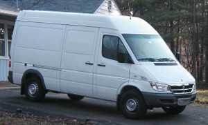
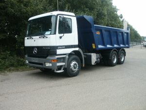

# Supported Vehicles

The Routing, Matrix and Route Optimization APIs support the following vehicles:

name       | description           | Restrictions              | Icon                                                     |  Real life image
-----------|:----------------------|:--------------------------|:---------------------------------------------------------|:--------------------
car        | Car mode              | car access                |    | 
small_truck| Small truck like a Mercedes Sprinter, Ford Transit or Iveco Daily | height=2.7m, width=2+0.4m, length=5.5m, weight=2080+1400 kg |    |  
truck      | Truck like a MAN or Mercedes-Benz Actros | height=3.7m, width=2.6+0.5m, length=12m, weight=13000 + 13000 kg, hgv=yes, 3 Axes | | 
scooter    | Moped mode | Fast inner city, often used for food delivery, is able to ignore certain bollards, maximum speed of roughly 50km/h |    | 
foot       | Pedestrian or walking | foot access         |        |
hike       | Pedestrian or walking with priority for more beautiful hiking tours and potentially a bit longer than `foot`  | foot access         |        |
bike       | Trekking bike avoiding hills | bike access  |        |
mtb        | Mountainbike          | bike access         | |
racingbike| Bike preferring roads | bike access         | |

<!-- MAN https://de.wikipedia.org/wiki/Datei:MAN_TGS_26.480_dump_truck.JPG 
     MAN https://de.wikipedia.org/wiki/Lastkraftwagen#/media/File:MAN_M2000_Pritschenwagen.jpg 
     coach https://commons.wikimedia.org/wiki/File:MAZ-251-Reisebus_in_M%C3%BCnchen_-_Seitenansicht.jpg
-->

**Please note, that turn restrictions are considered only with `ch.disable=true`
and for the free package you can only choose from `car`, `bike` or `foot`.**

If you need car routing that uses speed estimated from traffic data, then we also provide
this via TomTom data. [Please contact us](https://www.graphhopper.com/contact-form/) for more
details.

We also offer a sophisticated `motorcycle` profile powered by the [Kurviger](https://kurviger.de/en) Routing API. 
Kurviger favors curves and slopes while avoiding cities and highways.

Also we offer vehicle profiles with different properties, different speed profiles
or different access options.

You can try the route results for every profile with [GraphHopper Maps](https://graphhopper.com/maps/)
