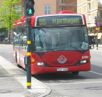

# Supported Vehicles

The Routing, Matrix and Route Optimization APIs support the following vehicles:

name       | description           | Restrictions              | Icon                                                     | Example models                | Real life image
-----------|:----------------------|:--------------------------|:---------------------------------------------------------|:------------------------------|:--------------------
car        | Car mode              | car access                |    |                               |
motorcycle | Motor bike avoiding motorways | motorcycle access |  |                   |
small_truck| Small truck           | 5% slower than car, height=2.7m, width=2+0.4m, length=5.5m, weight=2080+1400 kg |            | Mercedes Sprinter, Ford Transit, Iveco Daily | 
bus        | overland bus, no psv  | 10% slower than car, height=3.54m, width=2.55+0.5m, length=10.34m, weight=9600 + 6000 kg |                   | | 
truck      | Truck                 | 15% slower than car, height=3.7m, width=2.6+0.5m, length=12m, weight=13000 + 13000 kg, hgv=yes, 3 Axes | | MAN, Mercedes-Benz Actros | 
foot       | Pedestrian or walking | foot access         |        ||
bike       | Trekking bike avoiding hills | bike access  |        ||
mtb        | Mountainbike          | bike access         | ||
racing bike| Bike preferring roads | bike access         | ||

<!-- MAN https://de.wikipedia.org/wiki/Datei:MAN_TGS_26.480_dump_truck.JPG -->
<!-- MAN https://de.wikipedia.org/wiki/Lastkraftwagen#/media/File:MAN_M2000_Pritschenwagen.jpg -->
**Please not that currently none of the vehicles accounts for turn restrictions.**
